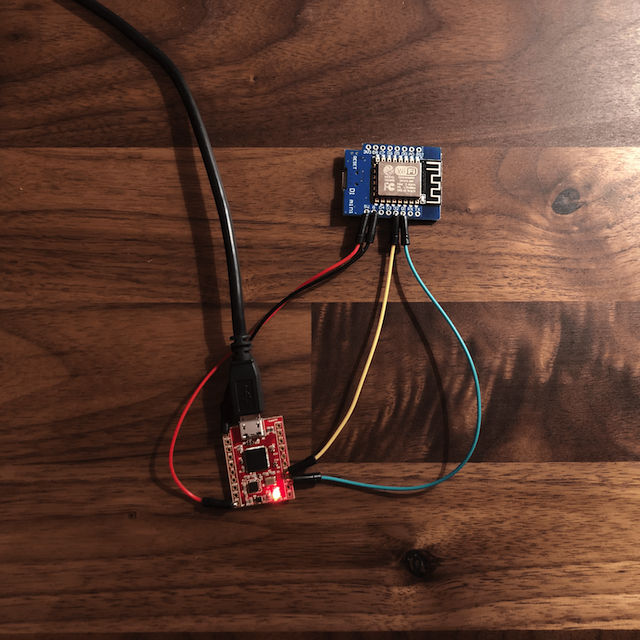

# myAHRS+ / WeMos D1 Mini ESP8266 WiFi Communication

## myAHRS-euler-wifi:

An Arduino project that configures the WiFi of the D1 Mini WiFi board, creates an I2C connection with the myAHRS+ sensor.

I2C specification: (D1 Mini WiFi is MASTER, myAHRS+ is SLAVE). Makes use of myAHRS+ I2C register mapping sample code. 

WeMos D1 Mini ESP8266 retrieves Euler angles from the orientation sensor, via I2C protocol, and sends them through UDP packets to a user-specified port (4210 by default) of the local network at a specified rate (default is every 100ms).

The myAHRS+ is capable of up to 1kHz I2C connectivity.

## Installing the myAHRS-euler-wifi project onto the D1 Mini ESP8266 Wifi Board

The WiFi board can be programmed through the Arduino IDE.
```
Step 1: Install the USB-to-SERIAL conversion driver: 
        https://wiki.wemos.cc/downloads (Windows and Mac OS X)
        
Step 2: Open your Arduino IDE, go to Preferences, paste this link under 'Additional Boards Manager URLs':
        http://arduino.esp8266.com/versions/2.5.0-beta2/package_esp8266com_index.json
        
Step 3: In Arduino, go to Tools -> Board -> Boards Manager... 
        Type in esp8266 and download the board package.
        
Step 4: Plug in the WeMos D1 Mini via Micro USB.

Step 5: Go to Tools -> Board and select: LOLIN(WEMOS) D1 R2 & Mini

Step 6: Go to Tools -> Upload Speed and select: 115200

Step 7: Go to Tools -> Port and ensure the correct COM port is selected.

Step 8: Change the wifiSSID, wifiPassword variables within the Arduino code to the local network's SSID and password.
        You may also change the desired refresh rate and UDP port.

Step 8: Upload the myAHRS-euler-wifi.ino project code onto the WeMos D1 Mini Wifi Board
```

## Wiring the D1 Mini WiFi Board to the myAHRS+ IMU



Wiring for this is fairly simple, requires 4 wires between the two boards.
Here are the required pin connections:

| WeMos D1 Mini WiFi | myAHRS+ IMU |
| ------------- | ------------- |
| 5V  | VDD  |
| G  | GND  |
| D2  | SDA  |
| D1  | SCL  |

For power, use the myAHRS+ Micro USB port.

The entire unit should now be spitting out XYZ values at the specified refreshr rate via UDP packets to the local network.
## udp-recv.c:


A C program that sniffs a designated port (4210 by default) for UDP packets, parses and displays them as a string. Enables the user to access and observe the Euler angles provided by the myAHRS+ IMU in real time - over a Wifi connection.

Command Line Instructions:    
```
make
./udp-recv
```

Note: If you changed the designated UDP port in the Arduino code, you must change it here as well.

To change the port the udp socket is bound to, edit port.h.


(A modified version of Paul Krzyzanowski's [demo-udp-03](https://www.cs.rutgers.edu/~pxk/417/notes/sockets/demo-udp-03.html))
